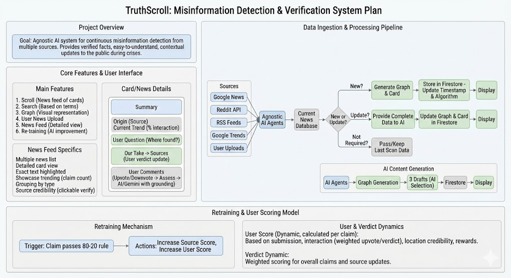

---

### Backend `backend/README.md`
*Focuses on the Logic, Agent Architecture, and Data Pipeline.*

# TruthScroll Backend & Agent

**Tech:** Python, Google Gemini 3.0 Pro, Reddit API (PRAW), Firebase.

### **Agent Architecture**

