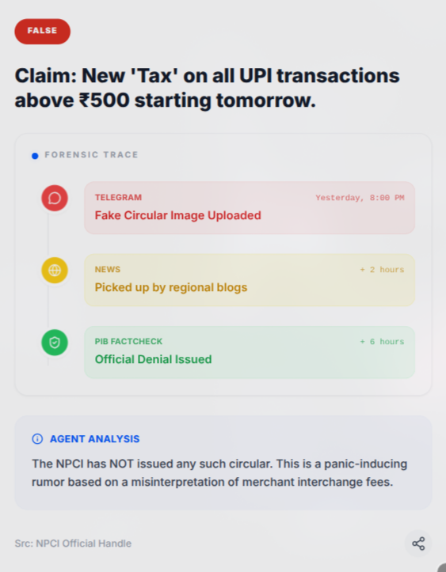
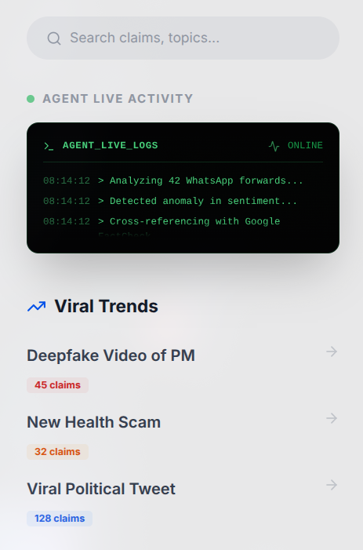
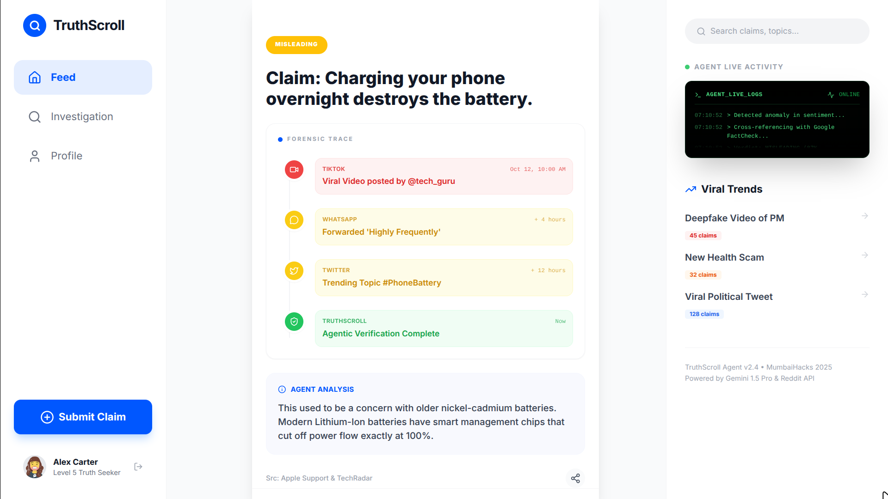

# TruthScroll Frontend

**Tech:** React, Vite, Tailwind CSS, Framer Motion.

### **Outcome**

| **Mobile Feed** | **Agent Console** |
|:---:|:---:|
|  |  |

| **WhatsApp Analysis** | **Desktop Dashboard** |
|:---:|:---:|
|  |  |

### **Key UI Capabilities**

1.  **Responsive:** Fully functional on Mobile (App-feel) and Desktop (Dashboard-feel).
2.  **Interactive:** Polls, Quizzes, and "Swipe" gestures.
3.  **Visuals:** Dynamic "Origin Graphs" rendered through data from backend.

### **Run Locally**

```bash
cd frontend
npm install
npm run dev
